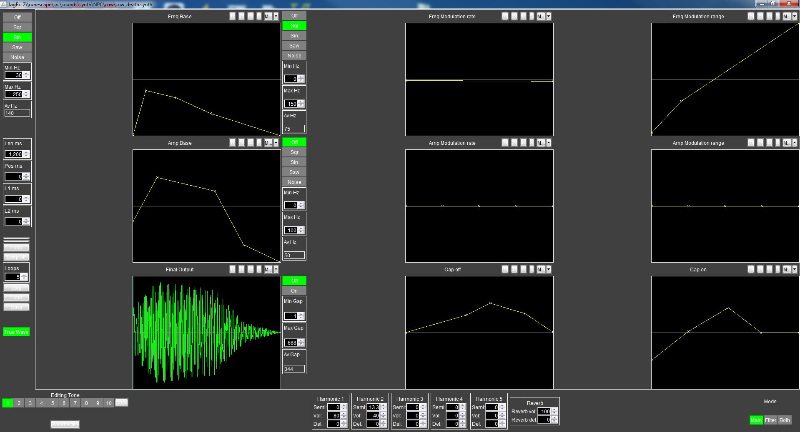
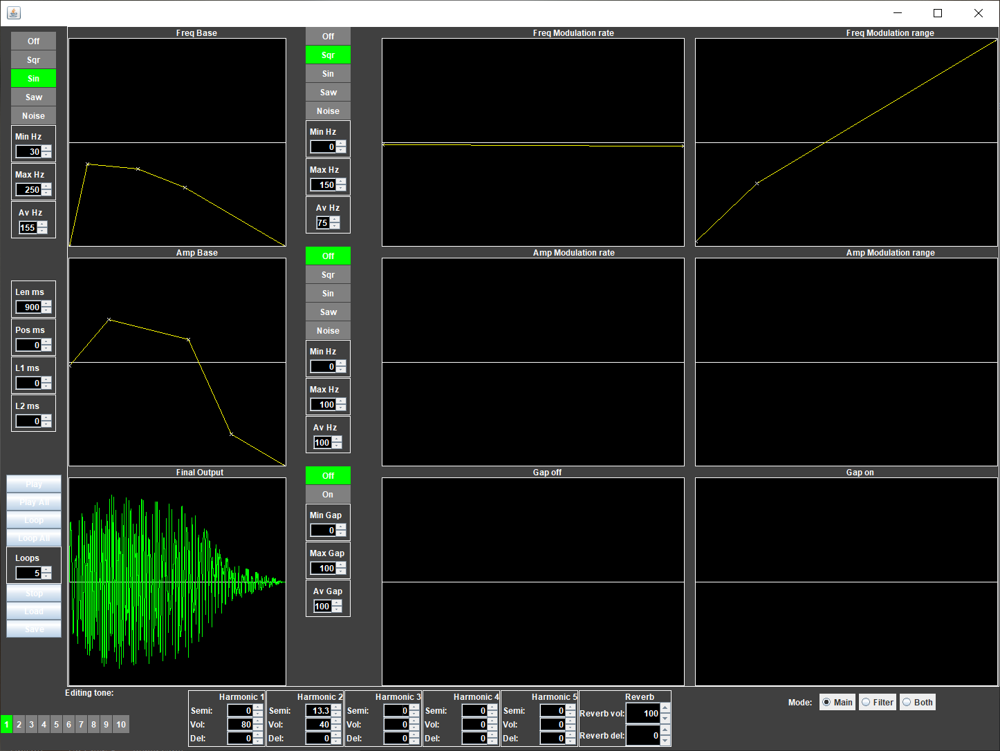
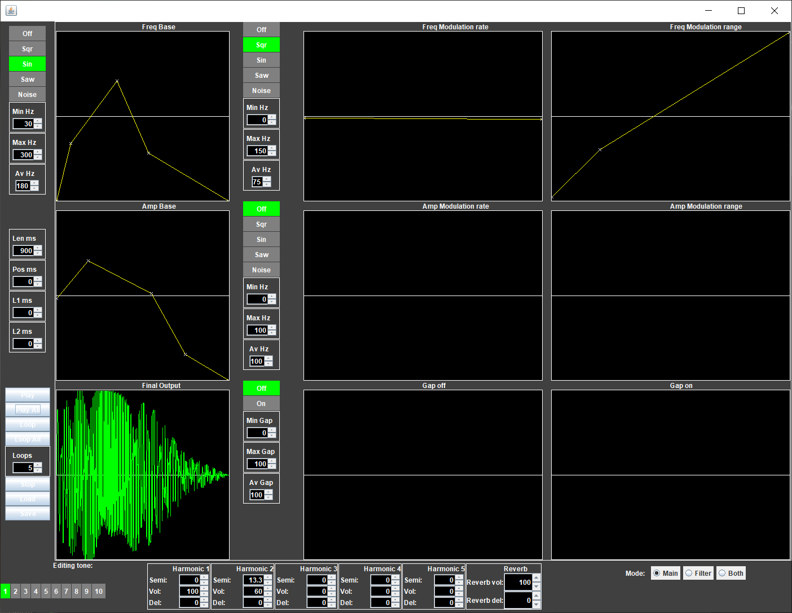

### What is this?

Have you ever wondered how the sound effects in old school runescape were (or more specifically, continually are) generated? This project is a (wip) attempt to recreate the original GUI of the JagFx synthesizer. [Scroll down to screenshots](#Screenshots)

### Why?

I wanted to play around with it, and more importantly understand how everything was done.

### Is it functional?

A lot of things are functional, but some aren't. Feel free to contribute, just make a pull request, or contact me `@luc_ass.` on discord.

There is no way to:
* Save a synth config or export to .wav
* Enable the filter, or change filter parameters
* View a filters' frequency response
* Not resynthesize all samples way too often because of shoddy vibe coding (performance "issue")

If you search for `todo` in this project you'll probably also find more stuff to do, if that's your thing.

### Screenshots

_Screenshot from Ian Taylor on twitter (The cow death sound, annoyingly with some parameters changed from the actual sound)_

_Comparison, same parameters modified_

_This is what it actually is like!_

## Credits

Andrew Gower, mostly, I think. Absolute legend.

Runelite, for the osrs cache library

The three pieces of reference media!!!!!1